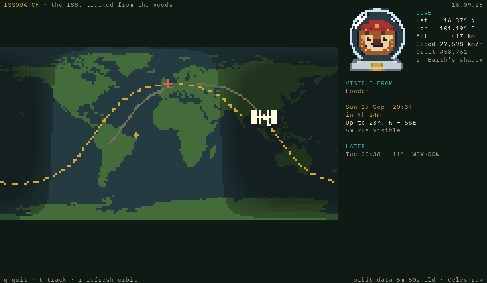
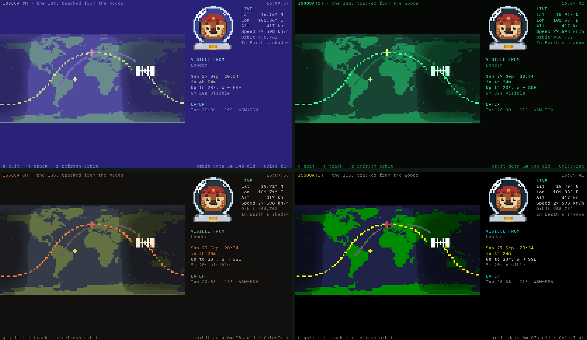

<p align="center">
  
</p>

<h1 align="center">issquatch</h1>

<p align="center">
  <b>The International Space Station, tracked from the woods.</b><br>
  A floating TUI for <a href="https://omarchy.org">Omarchy</a>: where the ISS is, where it's going,
  and when you can walk outside and see it.<br>
  <a href="https://squatchware.dev/issquatch/">squatchware.dev/issquatch</a>
</p>

Press <kbd>Super</kbd> + <kbd>Alt</kbd> + <kbd>I</kbd> and a little window pops up over your
tiles. It shows a pixel world map with the day/night line, the station, the last 45 minutes of
its ground track and the next 90, plus a panel with its speed, height and whether it's in
sunlight, watched over by the squatch in a space helmet. Tell it where you live and it lists the
passes you can actually see (the station lit by the sun while your sky is dark), then taps you on
the shoulder ten minutes before a good one.

It wears your Omarchy theme and repaints when you switch.



## Install

Needs Omarchy (Lua Hyprland config) and Python 3.11+, which Omarchy already has.

```sh
curl -fsSL https://raw.githubusercontent.com/squatchware/issquatch/main/install.sh | bash
issquatch setup          # where you're watching from
```

Or from a checkout (read `install.sh` first, it's short):

```sh
git clone https://github.com/squatchware/issquatch && cd issquatch && ./install.sh
```

The installer makes a private virtualenv with [`sgp4`](https://pypi.org/project/sgp4/) in
`~/.local/share/issquatch`, links `issquatch` into `~/.local/bin`, adds a Hyprland window rule and
the keybinding, and turns on a systemd user timer for pass notifications. Pick another key with
`ISSQUATCH_KEY="SUPER + SHIFT + I" ./install.sh` (or `none`), skip notifications with
`ISSQUATCH_NOTIFY=0`, and take it all out with `./install.sh --uninstall`.

## Use

| Key / command | What it does |
|---|---|
| <kbd>Super</kbd> + <kbd>Alt</kbd> + <kbd>I</kbd> | Open the map, or focus it if it's already open |
| <kbd>t</kbd> · <kbd>r</kbd> · <kbd>q</kbd> | Toggle the ground track · refresh the orbit · quit |
| `issquatch setup [PLACE]` | Set your location: a town, an address, or `lat, lon` |
| `issquatch passes [--all] [--week]` | Visible passes for the next 3 (or 7) days. `--all` adds the unlit ones |
| `issquatch now [--json]` | One line of where it is right now, for scripts and bars |
| `issquatch notify [--test]` | What the timer runs. `--test` sends the next one immediately |

Settings live in `~/.config/issquatch/config.toml`:

```toml
lat = 51.5072
lon = -0.1276
place = "London"
notify_minutes = 10         # how far ahead to warn you
min_elevation = 10          # ignore passes lower than this
notify_min_elevation = 20   # only notify for passes that climb at least this high
blocks = "auto"             # "octant" (sharp, needs Ghostty or kitty) or "half" (works everywhere)
```

## How it works

- **Orbit:** the ISS's two-line element set from [CelesTrak](https://celestrak.org), cached for 12
  hours, propagated with SGP4 (the model the TLEs are made for). Positions agree with
  wheretheiss.at to a tenth of a degree, and pass times agree with Skyfield to the second.
- **Visible passes:** above 10°, with the station in sunlight (outside Earth's shadow) while the
  sun is at least 6° below your horizon. That's when it's the bright, steady dot people spot.
- **Map:** Natural Earth's 1:110m coastlines (public domain), baked into a half-degree bitmap. In
  Ghostty and kitty it's drawn with Unicode 16 octants, eight square pixels to a character; other
  terminals get half blocks, two to a character. The night side comes from the subsolar point.
- **Privacy:** a place name is looked up once with OpenStreetMap's Nominatim when you run
  `setup`. Nothing else leaves your machine apart from the CelesTrak download.

## License

MIT, see [LICENSE](LICENSE). The Squatchware name and the sasquatch are not covered by that
licence and aren't for reuse.

From [Squatchware](https://squatchware.dev) · Pixel-powered apps, tools & themes. Handmade in the woods.
